# Panduan Pengguna — Tarombo Marga Hariandja

> Sistem Pohon Keluarga Digital Marga Hariandja

---

## Daftar Isi

1. [Pendahuluan](#1-pendahuluan)
2. [Memulai](#2-memulai)
3. [Beranda & Pencarian Keluarga](#3-beranda--pencarian-keluarga)
4. [Dashboard Statistik](#4-dashboard-statistik)
5. [Pohon Tarombo](#5-pohon-tarombo)
6. [Data Anggota](#6-data-anggota)
7. [Detail Anggota](#7-detail-anggota)
8. [Menambah & Mengedit Anggota](#8-menambah--mengedit-anggota)
9. [Data Pernikahan](#9-data-pernikahan)
10. [Kelola Pengguna](#10-kelola-pengguna)
11. [Pencadangan Data](#11-pencadangan-data)
12. [Log Audit](#12-log-audit)
13. [Ganti Password](#13-ganti-password)
14. [Tampilan Mobile](#14-tampilan-mobile)
15. [Pengaturan Tambahan](#15-pengaturan-tambahan)
16. [Tingkatan Hak Akses (RBAC)](#16-tingkatan-hak-akses-rbac)

---

## 1. Pendahuluan

### Apa itu Tarombo?

**Tarombo** adalah sistem genealogi (silsilah) yang digunakan secara turun-temurun oleh masyarakat Batak, khususnya dalam marga-marga Batak Toba. Tarombo berfungsi untuk mencatat dan menghubungkan garis keturunan dari satu nenek moyang hingga generasi-generasi berikutnya. Dalam adat Batak, mengetahui tarombo marga sangat penting karena berkaitan erat dengan:

- **Dalihan Na Tolu** — sistem kekerabatan sosial Batak yang meliputi Toga (kahanggi), Boru, dan Dongan Sabutuha.
- **Hagabeon** — harapan agar keturunan marga berkembang dan sejahtera.
- **Identitas Marga** — setiap orang Batak wajib mengetahui marga dan tarombo-nya sebagai bagian dari identitas diri.

Secara tradisional, tarombo dihafalkan secara lisan atau ditulis di kulit kayu (*laklak*) dan papan kayu. Namun seiring perkembangan zaman, banyak tarombo yang hilang atau terlupakan. Aplikasi digital ini hadir untuk menjawab tantangan tersebut.

### Tentang Aplikasi Tarombo Marga Hariandja

**Tarombo Marga Hariandja** adalah aplikasi web berbasis digital yang dirancang khusus untuk mendokumentasikan, memvisualisasikan, dan mengelola pohon keluarga (tarombo) Marga Hariandja. Aplikasi ini memungkinkan seluruh anggota marga untuk:

- Mencatat data anggota keluarga secara terstruktur
- Melihat visualisasi pohon keluarga secara interaktif
- Mencari dan melacak hubungan kekerabatan
- Mengelola data pernikahan antar anggota
- Mencadangkan dan memulihkan data kapan saja

### Fitur Utama

| Fitur | Deskripsi |
|-------|-----------|
| 🌳 **Pohon Tarombo Interaktif** | Visualisasi silsilah keluarga dengan D3.js, mendukung zoom, pan, dan pencarian anggota |
| 📊 **Dashboard Statistik** | Grafik distribusi jenis kelamin, status pernikahan, rata-rata umur, dan jumlah generasi |
| 👥 **Manajemen Anggota** | CRUD data anggota keluarga lengkap dengan foto, informasi orang tua, dan anak-anak |
| 💍 **Data Pernikahan** | Pencatatan pernikahan dengan status Aktif, Tidak Aktif, dan Cerai |
| 🔍 **Pencarian Keluarga** | Pencarian cepat anggota keluarga dari beranda |
| 👤 **Kelola Pengguna** | Sistem multi-pengguna dengan tiga tingkatan hak akses (RBAC) |
| 💾 **Pencadangan Data** | Ekspor dan impor seluruh data dalam format JSON |
| 📋 **Log Audit** | Riwayat aktivitas seluruh pengguna untuk transparansi dan keamanan |
| 🌙 **Mode Gelap** | Dukungan tampilan terang dan gelap (dark mode) |
| 🌐 **Multi-Bahasa** | Tersedia dalam Bahasa Indonesia, English, dan Batak Toba (ᯅᯖᯂ᯲) |
| 📱 **Responsif** | Tampilan yang nyaman di desktop maupun perangkat mobile |

---

## 2. Memulai

### Cara Mengakses Aplikasi

Aplikasi Tarombo Marga Hariandja dapat diakses melalui browser web (Chrome, Firefox, Safari, Edge) di alamat yang disediakan oleh pengelola sistem. Pastikan Anda memiliki koneksi internet yang stabil.

Buka alamat aplikasi di browser, dan Anda akan diarahkan ke halaman **Login**.

### Halaman Login

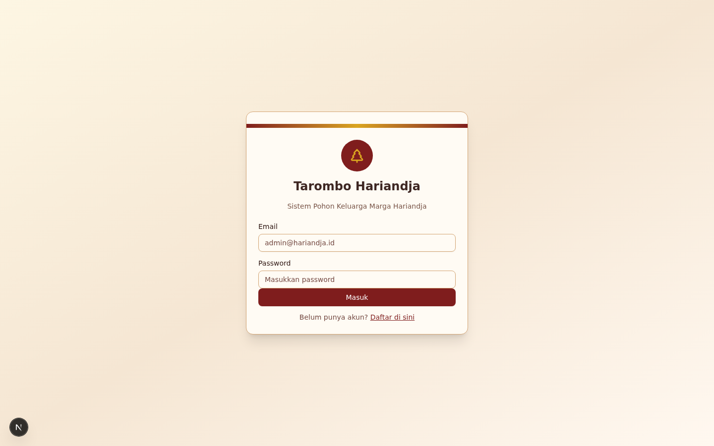

Halaman login adalah pintu masuk untuk mengakses seluruh fitur aplikasi. Untuk masuk, Anda memerlukan **Email** dan **Password** yang telah terdaftar di sistem.

**Langkah-langkah login:**

1. Masukkan alamat email Anda di kolom **Email**
2. Masukkan password Anda di kolom **Password**
3. Klik tombol **Masuk**

**Akun default untuk Administrator:**

| Field | Nilai |
|-------|-------|
| Email | `admin@hariandja.id` |
| Password | `admin123` |

> ⚠️ **Penting:** Segera ubah password default setelah login untuk pertama kali demi keamanan akun Anda.

### Halaman Pendaftaran

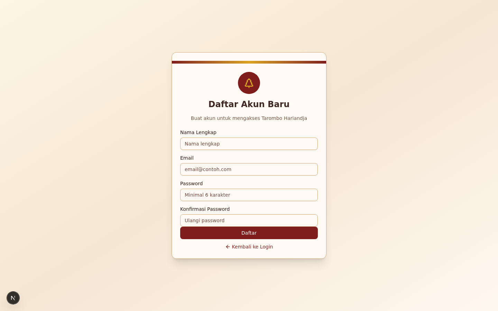

Jika Anda belum memiliki akun, Anda dapat mendaftar melalui halaman pendaftaran. Klik link **Daftar** di halaman login untuk menuju formulir pendaftaran.

**Langkah-langkah pendaftaran:**

1. Klik link **Daftar** di bawah formulir login
2. Isi formulir pendaftaran:
   - **Nama** — Nama lengkap Anda
   - **Email** — Alamat email yang valid
   - **Password** — Password minimal 8 karakter
3. Klik tombol **Daftar**

Setelah berhasil mendaftar, akun Anda akan dibuat dengan role **Pengamat (Viewer)** secara default. Untuk mendapatkan akses yang lebih tinggi (Editor atau Administrator), hubungkan Administrator sistem.

---

## 3. Beranda & Pencarian Keluarga

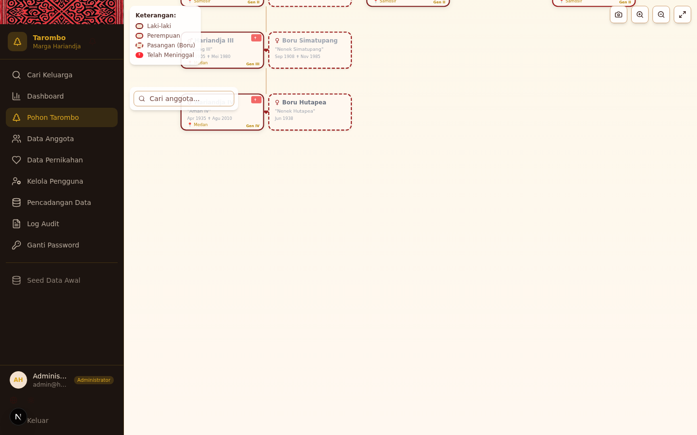

Setelah berhasil login, Anda akan diarahkan ke halaman **Beranda**. Halaman ini menampilkan fitur pencarian keluarga yang memungkinkan Anda menemukan anggota keluarga dengan cepat.

### Cara Mencari Anggota Keluarga

1. **Ketik nama** anggota keluarga yang ingin dicari di kolom pencarian
2. Sistem akan menampilkan **hasil pencarian secara real-time** seiring Anda mengetik
3. Hasil pencarian menampilkan nama lengkap, marga, dan informasi singkat lainnya

### Navigasi dari Hasil Pencarian

Setelah menemukan anggota yang dicari, Anda dapat:

- **Klik nama anggota** untuk melihat halaman detail lengkapnya
- Hasil pencarian akan menampilkan informasi ringkas berupa nama, jenis kelamin, dan tanggal lahir

Pencarian di beranda merupakan cara tercepat untuk menemukan anggota keluarga tanpa harus masuk ke menu Data Anggota.

---

## 4. Dashboard Statistik

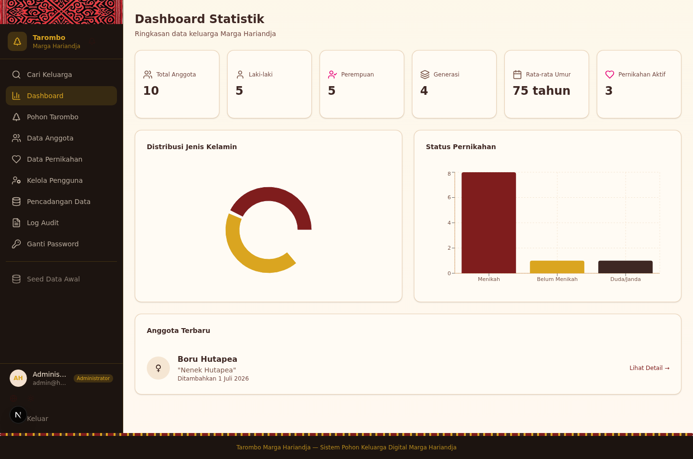

Dashboard Keluarga menampilkan ringkasan statistik seluruh anggota Marga Hariandja yang tercatat dalam sistem. Halaman ini dapat diakses melalui menu **Dashboard** di sidebar.

### Statistik yang Ditampilkan

| Kartu Statistik | Deskripsi |
|-----------------|-----------|
| **Total Anggota** | Jumlah keseluruhan anggota keluarga yang terdaftar |
| **Laki-laki** | Jumlah anggota berjenis kelamin laki-laki |
| **Perempuan** | Jumlah anggota berjenis kelamin perempuan |
| **Generasi** | Jumlah generasi yang tercatat dalam pohon keluarga |
| **Rata-rata Umur** | Rata-rata umur seluruh anggota |
| **Pernikahan Aktif** | Jumlah pasangan yang statusnya masih aktif |

### Grafik Distribusi

Dashboard juga menampilkan grafik visual berupa:

- **Distribusi Jenis Kelamin** — Grafik pie/bar yang menunjukkan perbandingan jumlah laki-laki dan perempuan
- **Status Pernikahan** — Grafik yang menggambarkan distribusi status pernikahan seluruh anggota
- **Anggota Terbaru** — Daftar anggota yang baru saja ditambahkan ke dalam sistem

### Dashboard Mode Gelap

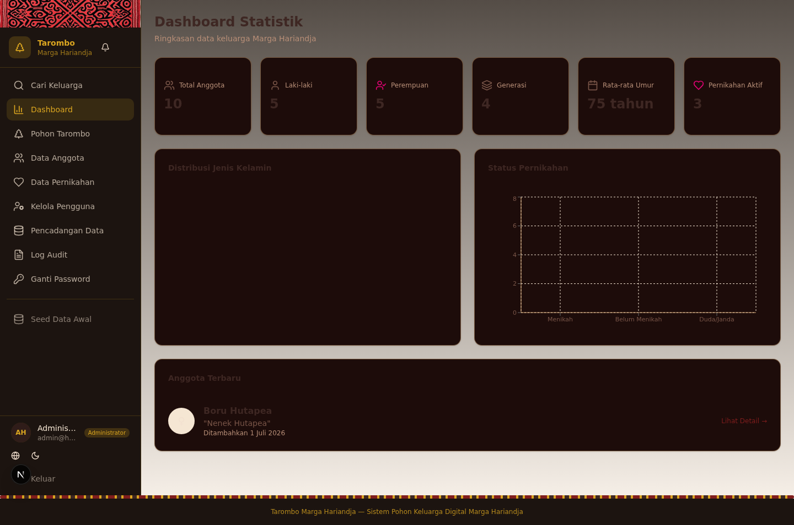

Aplikasi mendukung tampilan **mode gelap** yang lebih nyaman untuk penggunaan di lingkungan dengan pencahayaan rendah. Untuk beralih ke mode gelap, gunakan toggle di sidebar (lihat [Pengaturan Tambahan](#15-pengaturan-tambahan)).

---

## 5. Pohon Tarombo

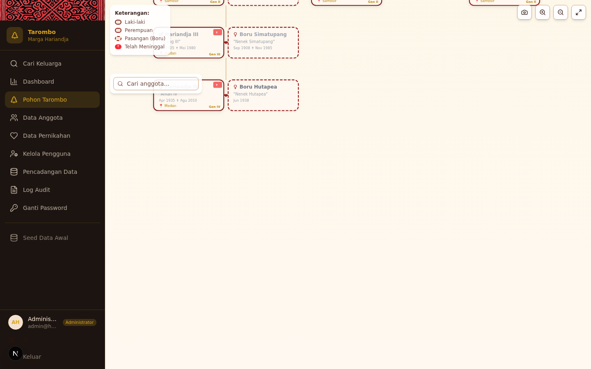

Halaman **Pohon Tarombo** adalah fitur utama dan unggulan dari aplikasi ini. Halaman ini menampilkan visualisasi pohon keluarga secara interaktif menggunakan teknologi D3.js.

### Visualisasi Pohon Keluarga Interaktif

Pohon keluarga ditampilkan dalam format hierarki vertikal dari atas ke bawah, di mana:

- **Generasi tertua** berada di bagian atas
- **Generasi termuda** berada di bagian bawah
- Setiap anggota terhubung dengan garis keturunan ke orang tua dan anak-anaknya
- Pasangan (boru) ditampilkan di samping anggota keluarga inti

### Zoom In/Out dan Pan

Anda dapat menjelajahi pohon keluarga yang besar dengan:

- **Scroll mouse** — Zoom in (perbesar) dan zoom out (perkecil)
- **Klik dan geser (drag)** — Menggeser tampilan pohon ke arah yang diinginkan
- **Tombol Zoom** — Gunakan tombol zoom in (+) dan zoom out (-) di toolbar
- **Tombol Maximize** — Klik ikon maximize untuk menyesuaikan tampilan agar seluruh pohon terlihat

### Pencarian Anggota di Pohon

Terdapat kolom pencarian di bagian atas halaman pohon:

1. Ketik nama anggota yang ingin ditemukan
2. Pohon akan otomatis **memfokuskan tampilan** pada anggota yang dicari
3. Anggota yang ditemukan akan diberi tanda/highlight agar mudah dikenali

### Legenda

Pohon tarombo dilengkapi dengan legenda yang menjelaskan kode warna dan ikon:

| Simbol | Keterangan |
|--------|------------|
| 🔵 **Biru** | Anggota berjenis kelamin **Laki-laki** |
| 🩷 **Merah Muda** | Anggota berjenis kelamin **Perempuan** |
| 🔗 **Tanda Pasangan** | **Pasangan (Boru)** yang bukan anggota marga inti |
| ✝️ **Tanda Silang** | Anggota yang **telah meninggal dunia** |

Setiap generasi juga ditandai dengan label **"Gen 1", "Gen 2"**, dan seterusnya di sisi kiri pohon.

### Ekspor ke SVG

Anda dapat mengunduh visualisasi pohon keluarga dalam format **SVG** (Scalable Vector Graphics):

1. Klik tombol **"Ekspor SVG"** di toolbar
2. File SVG akan otomatis terunduh ke perangkat Anda
3. File SVG dapat dibuka di browser, editor gambar, atau dicetak dalam resolusi tinggi

### Klik pada Anggota untuk Melihat Detail

Klik pada node (kotak nama) anggota di pohon untuk melihat **detail informasi** anggota tersebut. Detail akan ditampilkan dalam panel pop-up atau dialog yang berisi:

- Nama lengkap dan nama panggilan
- Jenis kelamin dan tanggal lahir
- Status (hidup/meninggal)
- Informasi pasangan (jika ada)
- Link untuk melihat halaman detail lengkap

---

## 6. Data Anggota

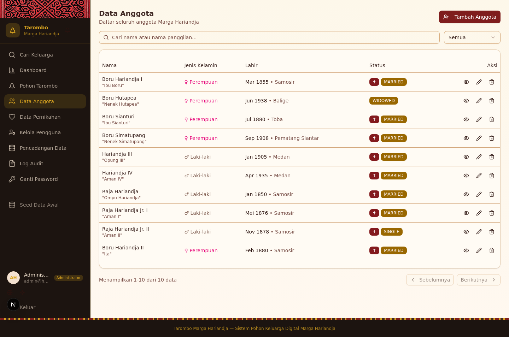

Halaman **Data Anggota** menampilkan daftar seluruh anggota keluarga yang tercatat dalam sistem. Halaman ini dapat diakses melalui menu **Data Anggota** di sidebar.

### Daftar Anggota dengan Paginasi

Data anggota ditampilkan dalam tabel yang terorganisir dengan fitur **paginasi**:

- Setiap halaman menampilkan sejumlah anggota
- Gunakan tombol **Sebelumnya** dan **Berikutnya** untuk berpindah halaman
- Informasi **"Menampilkan X dari Y data"** ditampilkan di bagian bawah tabel

### Pencarian dan Filter Berdasarkan Jenis Kelamin

Anda dapat mempersempit daftar yang ditampilkan dengan:

- **Kolom Pencarian** — Ketik nama untuk memfilter anggota berdasarkan nama
- **Filter Jenis Kelamin** — Gunakan dropdown atau tombol filter untuk menampilkan:
  - Semua anggota
  - Hanya laki-laki
  - Hanya perempuan

### Aksi: Lihat, Edit, Hapus

Pada setiap baris anggota, tersedia tombol aksi di kolom **Aksi**:

| Tombol | Fungsi | Hak Akses |
|--------|--------|-----------|
| 👁 **Lihat** | Membuka halaman detail anggota | Semua role |
| ✏️ **Edit** | Membuka formulir edit data anggota | Editor ke atas |
| 🗑 **Hapus** | Menghapus data anggota (dengan konfirmasi) | Administrator |

> ⚠️ **Catatan:** Tombol Hapus hanya tersedia untuk pengguna dengan role **Administrator**. Penghapusan data bersifat permanen dan tidak dapat dibatalkan.

---

## 7. Detail Anggota

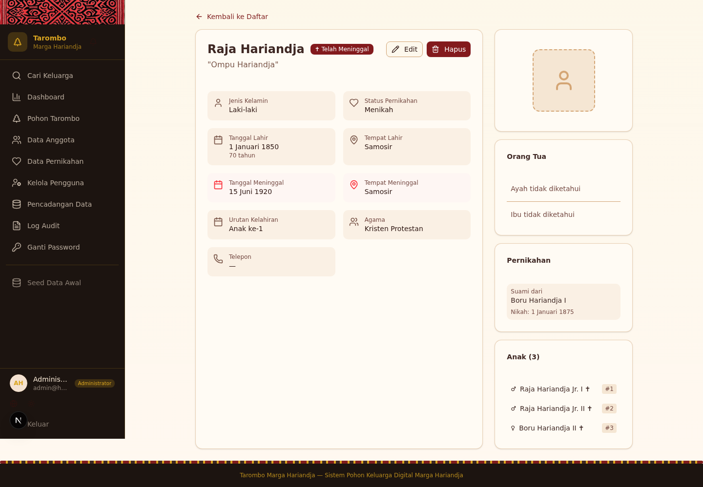

Halaman **Detail Anggota** menampilkan informasi lengkap seorang anggota keluarga. Halaman ini dibuka saat Anda mengklik tombol **Lihat** pada daftar anggota atau mengklik node anggota di pohon tarombo.

### Informasi Lengkap Anggota

Bagian utama menampilkan informasi dasar anggota:

- **Nama Lengkap** — Nama resmi anggota
- **Nama Panggilan** — Napa atau nama sehari-hari
- **Jenis Kelamin** — Laki-laki atau Perempuan
- **Tempat Lahir** — Tempat kelahiran anggota
- **Tanggal Lahir** — Tanggal lahir dalam format yang mudah dibaca
- **Alamat** — Alamat tempat tinggal saat ini
- **Agama** — Agama yang dianut
- **Telepon** — Nomor telepon yang dapat dihubungi
- **Status** — Hidup atau Telah Meninggal (beserta tanggal meninggal jika applicable)

### Foto Anggota

Jika anggota memiliki foto yang diunggah, foto akan ditampilkan di bagian atas halaman detail. Foto ini juga muncul di node pohon tarombo dan daftar anggota sebagai avatar.

### Orang Tua (Ayah & Ibu)

Halaman detail menampilkan informasi **orang tua** dari anggota yang bersangkutan:

- **Ayah** — Nama dan link ke halaman detail ayah
- **Ibu** — Nama dan link ke halaman detail ibu

Jika data orang tua tersedia, Anda dapat mengklik nama orang tua untuk navigasi ke halaman detail mereka.

### Anak-anak

Daftar **anak-anak** dari anggota ditampilkan di bagian bawah:

- Setiap anak ditampilkan dengan nama dan link ke halaman detailnya
- Anak-anak diurutkan berdasarkan urutan kelahiran (jika data tersedia)

### Pasangan/Pernikahan

Informasi **pasangan** dan **pernikahan** anggota ditampilkan dalam bagian tersendiri:

- Nama pasangan dengan link ke halaman detail
- Tanggal pernikahan
- Status pernikahan (Aktif, Tidak Aktif, atau Cerai)

---

## 8. Menambah & Mengedit Anggota

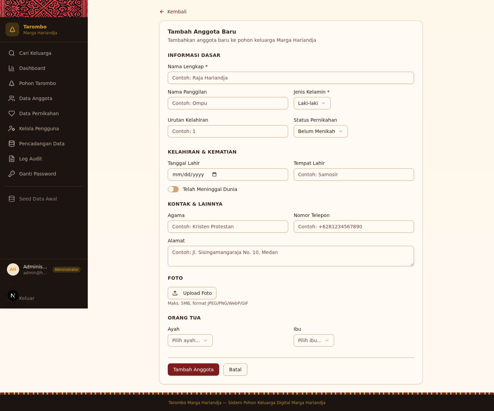

Formulir penambahan dan pengeditan anggota digunakan untuk memasukkan data baru atau memperbarui data anggota yang sudah ada.

### Formulir Penambahan Anggota Baru

Untuk menambah anggota baru, buka halaman **Data Anggota** lalu klik tombol **Tambah Anggota**. Formulir akan muncul dalam dialog/modal.

### Informasi Dasar

Bagian pertama dari formulir meminta informasi dasar anggota:

| Field | Keterangan | Wajib |
|-------|------------|-------|
| **Nama Lengkap** | Nama resmi sesuai dokumen identitas | Ya |
| **Nama Panggilan** | Napa/nama sehari-hari | Tidak |
| **Jenis Kelamin** | Pilih Laki-laki atau Perempuan | Ya |
| **Tempat Lahir** | Kota/tempat kelahiran | Tidak |
| **Tanggal Lahir** | Tanggal lahir (gunakan date picker) | Tidak |
| **Status** | Centang jika anggota telah meninggal | Tidak |
| **Tanggal Meninggal** | Hanya muncul jika status "Meninggal" dicentang | Kondisional |

### Informasi Tambahan

Bagian kedua berisi informasi opsional yang lebih detail:

| Field | Keterangan |
|-------|------------|
| **Alamat** | Alamat tempat tinggal lengkap |
| **Agama** | Agama yang dianut |
| **Telepon** | Nomor telepon/HP |

### Orang Tua

Bagian ketiga memungkinkan Anda menghubungkan anggota ini dengan orang tuanya:

- **Ayah** — Pilih dari daftar anggota laki-laki yang sudah terdaftar
- **Ibu** — Pilih dari daftar anggota perempuan yang sudah terdaftar

> 💡 **Tips:** Orang tua harus sudah terdaftar di sistem sebelum dapat dipilih. Jika belum, tambahkan orang tua terlebih dahulu, lalu edit kembali data anggota ini untuk menghubungkan.

### Upload Foto

Anda dapat mengunggah foto anggota:

1. Klik area upload atau tombol pilih file
2. Pilih file gambar (JPG, PNG, WebP)
3. Foto akan diunggah dan ditampilkan sebagai preview
4. Ukuran file yang disarankan tidak melebihi 2 MB

### Validasi Data

Formulir dilengkapi dengan validasi otomatis:

- **Nama Lengkap** wajib diisi — akan muncul pesan error jika dikosongkan
- **Jenis Kelamin** wajib dipilih
- Format tanggal akan divalidasi secara otomatis
- Pesan error ditampilkan di bawah field yang bermasalah

Setelah semua data terisi dengan benar, klik tombol **Simpan** untuk menyimpan data.

---

## 9. Data Pernikahan

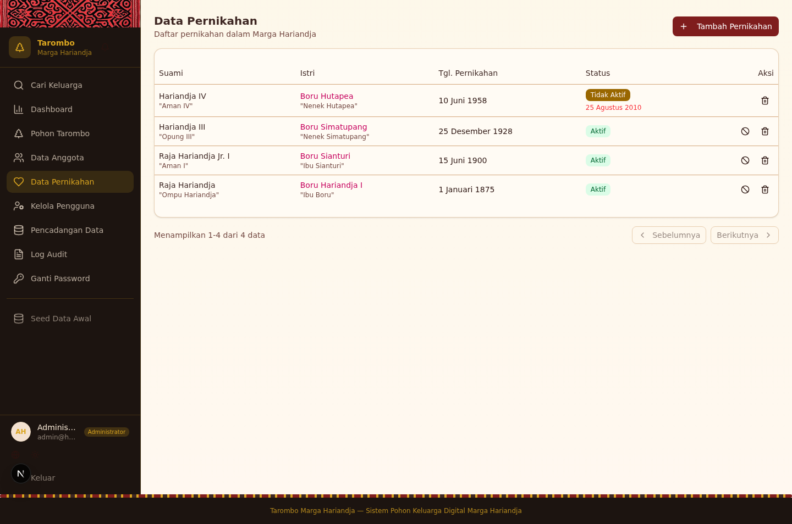

Halaman **Data Pernikahan** menampilkan daftar seluruh pernikahan yang tercatat dalam sistem. Halaman ini dapat diakses melalui menu **Data Pernikahan** di sidebar.

### Daftar Pernikahan

Pernikahan ditampilkan dalam tabel yang mencakup informasi:

- **Suami** — Nama anggota laki-laki
- **Istri/Boru** — Nama pasangan
- **Tanggal Pernikahan** — Tanggal resmi pernikahan
- **Status** — Status pernikahan saat ini

### Status Pernikahan

Sistem mengenal tiga status pernikahan:

| Status | Keterangan |
|--------|------------|
| 🟢 **Aktif** | Pasangan masih dalam ikatan pernikahan |
| 🟡 **Tidak Aktif** | Pernikahan tidak aktif (misalnya karena kematian salah satu pihak) |
| 🔴 **Cerai** | Pasangan telah bercerai secara resmi |

Status pernikahan ini juga mempengaruhi tampilan di pohon tarombo dan dashboard statistik.

### Menambah Pernikahan Baru

Untuk mencatat pernikahan baru:

1. Klik tombol **Tambah Pernikahan** di halaman Data Pernikahan
2. Isi formulir yang muncul:
   - Pilih **Suami** dari daftar anggota laki-laki
   - Pilih **Istri/Boru** dari daftar anggota
   - Masukkan **Tanggal Pernikahan**
   - Pilih **Status** pernikahan
3. Klik **Simpan**

Pernikahan yang baru ditambahkan akan otomatis tercermin di pohon tarombo (pasangan akan muncul di samping node anggota yang bersangkutan).

---

## 10. Kelola Pengguna

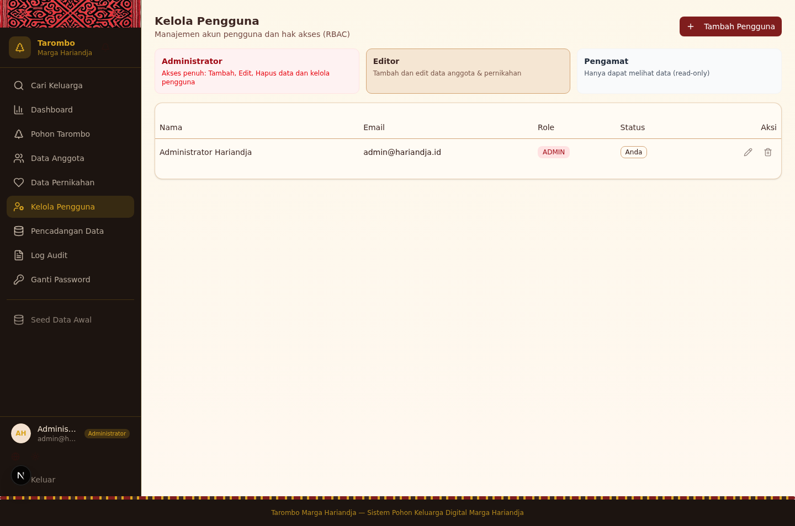

Halaman **Kelola Pengguna** hanya dapat diakses oleh pengguna dengan role **Administrator**. Halaman ini berfungsi untuk mengelola akun-akun pengguna yang dapat mengakses sistem.

> 🔒 **Hanya Administrator** yang dapat mengakses halaman ini. Jika Anda tidak melihat menu "Kelola Pengguna" di sidebar, berarti akun Anda tidak memiliki hak akses yang cukup.

### Menambah Pengguna Baru

Administrator dapat menambahkan pengguna baru:

1. Klik tombol **Tambah Pengguna**
2. Isi formulir:
   - **Nama** — Nama lengkap pengguna
   - **Email** — Alamat email untuk login
   - **Password** — Password awal
   - **Role** — Pilih tingkatan hak akses (lihat [RBAC](#16-tingkatan-hak-akses-rbac))
3. Klik **Simpan**

### Mengubah Role Pengguna

Administrator dapat mengubah role (tingkatan hak akses) pengguna yang sudah ada:

1. Temukan pengguna di daftar
2. Klik tombol **Edit** pada baris pengguna
3. Ubah **Role** ke tingkatan yang diinginkan
4. Klik **Simpan**

### Menonaktifkan Pengguna

Jika diperlukan, Administrator dapat menonaktifkan akun pengguna:

1. Temukan pengguna di daftar
2. Klik tombol aksi pada baris pengguna
3. Pilih opsi untuk menonaktifkan akun

Pengguna yang dinonaktifkan tidak akan dapat login ke sistem meskipun kredensialnya masih valid.

### Tiga Role yang Tersedia

| Role | Label | Keterangan |
|------|-------|------------|
| **ADMIN** | Administrator | Akses penuh ke seluruh fitur sistem |
| **EDITOR** | Editor | Dapat menambah dan mengedit data |
| **VIEWER** | Pengamat | Hanya dapat melihat data |

Untuk detail lengkap hak akses masing-masing role, lihat [Tingkatan Hak Akses (RBAC)](#16-tingkatan-hak-akses-rbac).

---

## 11. Pencadangan Data

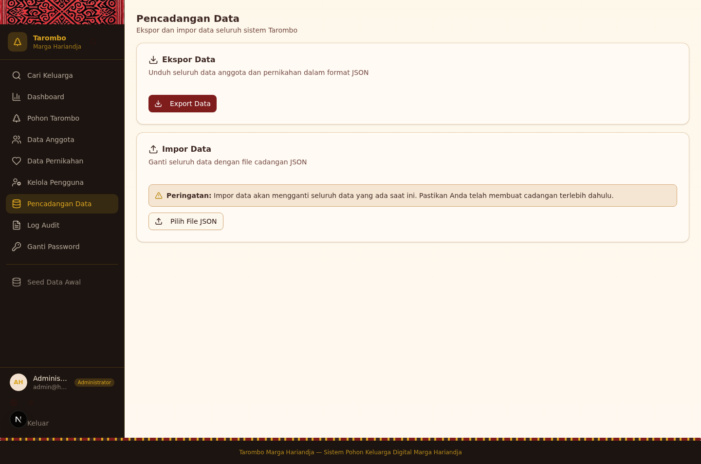

Halaman **Pencadangan Data** memungkinkan Administrator untuk melakukan backup (ekspor) dan restore (impor) seluruh data dalam sistem. Halaman ini dapat diakses melalui menu **Pencadangan Data** di sidebar.

### Ekspor Data ke JSON

Untuk mencadangkan data:

1. Buka halaman **Pencadangan Data**
2. Klik tombol **Ekspor Data**
3. File JSON akan otomatis terunduh ke perangkat Anda

File cadangan berisi seluruh data berikut:

- Data anggota keluarga (termasuk foto dalam format base64)
- Data pernikahan
- Struktur dan relasi antar anggota

> 💡 **Tips:** Lakukan pencadangan secara berkala (misalnya mingguan atau bulanan) untuk mencegah kehilangan data. Simpan file cadangan di lokasi yang aman.

### Impor Data dari File Cadangan

Untuk memulihkan data dari cadangan:

1. Buka halaman **Pencadangan Data**
2. Klik tombol **Impor Data**
3. Pilih file JSON cadangan yang ingin dipulihkan
4. Konfirmasi proses impor

> ⚠️ **Peringatan:** Impor data akan **mengganti seluruh data yang ada saat ini**. Pastikan Anda telah melakukan pencadangan data terbaru sebelum melakukan impor, karena data lama tidak dapat dikembalikan setelah proses impor selesai.

### Kapan Harus Melakukan Pencadangan?

- Sebelum melakukan pembaruan besar pada data
- Secara berkala (minimal sekali sebulan)
- Sebelum melakukan impor data
- Sebelum migrasi atau pemeliharaan sistem

---

## 12. Log Audit

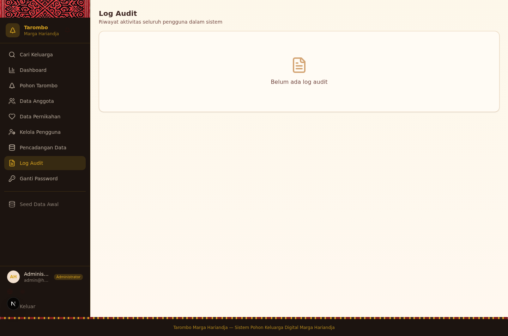

Halaman **Log Audit** mencatat seluruh aktivitas yang dilakukan oleh pengguna di dalam sistem. Fitur ini penting untuk menjaga **transparansi** dan **akuntabilitas** pengelolaan data keluarga.

Halaman ini hanya dapat diakses oleh **Administrator**.

### Riwayat Aktivitas Seluruh Pengguna

Setiap entri log audit mencatat:

| Kolom | Keterangan |
|-------|------------|
| **Waktu** | Tanggal dan waktu presisi ketika aksi dilakukan |
| **Pengguna** | Nama dan email pengguna yang melakukan aksi |
| **Aksi** | Jenis aktivitas (CREATE, READ, UPDATE, DELETE, LOGIN, dll.) |
| **Resource** | Tipe data yang diakses (Person, Marriage, User, dll.) |
| **Detail** | Informasi tambahan tentang aksi yang dilakukan |

### Filter Berdasarkan Aksi dan Pengguna

Anda dapat memfilter log audit untuk menemukan aktivitas spesifik:

- **Filter berdasarkan Aksi** — Pilih jenis aksi tertentu (CREATE, UPDATE, DELETE, dll.)
- **Filter berdasarkan Pengguna** — Pilih pengguna tertentu untuk melihat riwayat aktivitasnya

Kombinasi filter memungkinkan Anda menelusuri aktivitas dengan sangat spesifik, misalnya "semua aksi DELETE yang dilakukan oleh pengguna X".

---

## 13. Ganti Password

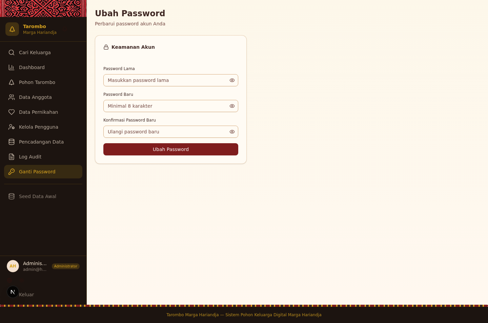

Halaman **Ganti Password** memungkinkan setiap pengguna untuk mengubah password akun mereka sendiri. Halaman ini dapat diakses melalui menu **Ganti Password** di sidebar.

### Mengubah Password Akun

Langkah-langkah untuk mengganti password:

1. Buka halaman **Ganti Password**
2. Masukkan **Password Lama** Anda saat ini
3. Masukkan **Password Baru** yang diinginkan
4. Masukkan kembali **Konfirmasi Password Baru** (harus sama dengan password baru)
5. Klik tombol **Simpan**

Jika password lama salah atau konfirmasi tidak cocok, sistem akan menampilkan pesan error.

### Indikator Kekuatan Password

Sistem menyediakan **indikator kekuatan password** yang menampilkan tingkat keamanan password baru Anda:

| Indikator | Kriteria |
|-----------|----------|
| 🔴 **Lemah** | Password terlalu pendek atau terlalu sederhana (kurang dari 8 karakter) |
| 🟡 **Sedang** | Password cukup panjang tetapi kurang variasi karakter |
| 🟢 **Kuat** | Password panjang dengan kombinasi huruf besar, huruf kecil, angka, dan simbol |

> 💡 **Tips Keamanan:** Gunakan password yang kuat dengan minimal 8 karakter, kombinasi huruf besar-kecil, angka, dan simbol. Jangan gunakan password yang mudah ditebak seperti tanggal lahir atau nama marga.

---

## 14. Tampilan Mobile

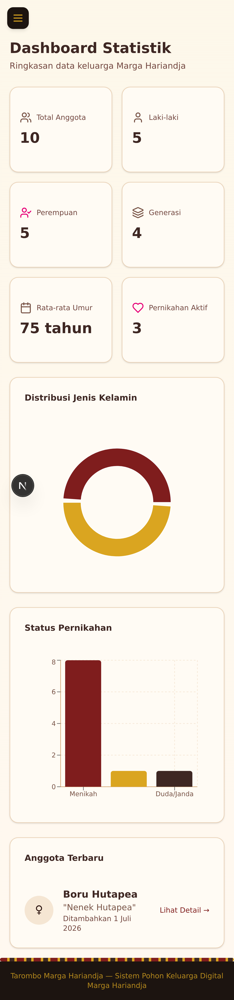

Aplikasi Tarombo Marga Hariandja dirancang dengan pendekatan **mobile-first** dan sepenuhnya responsif. Artinya, aplikasi dapat digunakan dengan nyaman di berbagai ukuran layar, mulai dari smartphone hingga monitor desktop.

### Responsivitas Aplikasi di Perangkat Mobile

Saat diakses dari perangkat mobile (smartphone atau tablet), aplikasi secara otomatis menyesuaikan tampilan:

- **Layout** berubah dari multi-kolom menjadi satu kolom
- **Tabel** disesuaikan agar dapat di-scroll secara horizontal
- **Tombol dan kontrol** diperbesar untuk kemudahan sentuhan (touch-friendly)
- **Font dan spacing** disesuaikan agar tetap terbaca di layar kecil

### Sidebar yang Bisa Di-Collapse

Pada perangkat mobile, sidebar navigasi akan otomatis tersembunyi untuk memberikan ruang tampilan yang lebih luas:

- **Buka sidebar** — Klik ikon hamburger menu (☰) di pojok kiri atas
- **Tutup sidebar** — Klik di luar area sidebar atau klik tombol tutup
- **Navigasi** — Semua menu tetap dapat diakses melalui sidebar yang terbuka

Sidebar menggunakan komponen **Sheet** (panel geser dari sisi) pada tampilan mobile, sehingga pengalaman pengguna tetap intuitif.

---

## 15. Pengaturan Tambahan

Aplikasi menyediakan beberapa pengaturan tambahan yang dapat diakses langsung dari sidebar navigasi.

### Mode Gelap/Terang

Toggle mode tampilan tersedia di **sidebar** navigasi:

- **☀️ Mode Terang** — Tampilan default dengan latar belakang terang
- **🌙 Mode Gelap** — Tampilan dengan latar belakang gelap yang nyaman untuk mata di lingkungan gelap

Klik ikon toggle di sidebar untuk beralih antara mode terang dan gelap. Preferensi Anda akan disimpan di browser sehingga tetap aktif saat Anda membuka kembali aplikasi.

### Bahasa

Aplikasi mendukung **tiga bahasa** yang dapat diubah melalui toggle bahasa di sidebar:

| Bahasa | Keterangan |
|--------|------------|
| 🇮🇩 **Indonesia** | Bahasa Indonesia (default) |
| 🇬🇧 **English** | Bahasa Inggris |
| 🅱️ **Batak Toba** | Bahasa Batak Toba (ᯅᯖᯂ᯲) |

Klik tombol toggle bahasa di sidebar untuk berpindah bahasa. Seluruh label, pesan, dan teks di aplikasi akan otomatis berubah sesuai bahasa yang dipilih. Pilihan bahasa disimpan di browser Anda.

---

## 16. Tingkatan Hak Akses (RBAC)

Sistem Tarombo Marga Hariandja menggunakan mekanisme **Role-Based Access Control (RBAC)** untuk mengatur hak akses pengguna. Terdapat tiga tingkatan hak akses dengan hierarki sebagai berikut:

### Administrator

Role tertinggi dengan **akses penuh** ke seluruh fitur sistem.

| Kemampuan | Ya/Tidak |
|-----------|----------|
| Melihat data anggota, pernikahan, pohon, dashboard | ✅ Ya |
| Menambah anggota baru | ✅ Ya |
| Mengedit data anggota dan pernikahan | ✅ Ya |
| Menghapus data anggota dan pernikahan | ✅ Ya |
| Mengelola pengguna (tambah, edit, nonaktifkan) | ✅ Ya |
| Melakukan pencadangan dan pemulihan data | ✅ Ya |
| Melihat log audit | ✅ Ya |
| Mengganti password sendiri | ✅ Ya |

### Editor

Role menengah yang dapat **menambah dan mengedit** data, tetapi tidak dapat menghapus atau mengelola pengguna.

| Kemampuan | Ya/Tidak |
|-----------|----------|
| Melihat data anggota, pernikahan, pohon, dashboard | ✅ Ya |
| Menambah anggota baru | ✅ Ya |
| Mengedit data anggota dan pernikahan | ✅ Ya |
| Menghapus data anggota dan pernikahan | ❌ Tidak |
| Mengelola pengguna | ❌ Tidak |
| Melakukan pencadangan dan pemulihan data | ❌ Tidak |
| Melihat log audit | ❌ Tidak |
| Mengganti password sendiri | ✅ Ya |

### Pengamat (Viewer)

Role terendah yang **hanya dapat melihat** data tanpa kemampuan mengubah apapun.

| Kemampuan | Ya/Tidak |
|-----------|----------|
| Melihat data anggota, pernikahan, pohon, dashboard | ✅ Ya |
| Menambah anggota baru | ❌ Tidak |
| Mengedit data anggota dan pernikahan | ❌ Tidak |
| Menghapus data anggota dan pernikahan | ❌ Tidak |
| Mengelola pengguna | ❌ Tidak |
| Melakukan pencadangan dan pemulihan data | ❌ Tidak |
| Melihat log audit | ❌ Tidak |
| Mengganti password sendiri | ✅ Ya |

### Ringkasan Hak Akses

| Fitur | Administrator | Editor | Pengamat |
|-------|:---:|:---:|:---:|
| Lihat data | ✅ | ✅ | ✅ |
| Tambah data | ✅ | ✅ | ❌ |
| Edit data | ✅ | ✅ | ❌ |
| Hapus data | ✅ | ❌ | ❌ |
| Kelola pengguna | ✅ | ❌ | ❌ |
| Backup & Restore | ✅ | ❌ | ❌ |
| Log Audit | ✅ | ❌ | ❌ |
| Ganti password sendiri | ✅ | ✅ | ✅ |

---

> *Tarombo Marga Hariandja — Sistem Pohon Keluarga Digital*
>
> Dokumen ini terakhir diperbarui pada 2025. Untuk pertanyaan atau bantuan teknis, hubungi Administrator sistem.